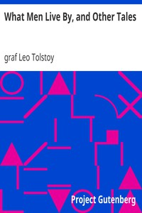

# What Men Live By, and Other Tales <kbd>v2.3.0</kbd>

## Authors

 - Tolstoy, Leo, graf <small>(1828 - 1910)</small>

## Translators

 - Maude, Aylmer <small>(1858 - 1938)</small>
 - Maude, Louise <small>(1855 - 1939)</small>

## Subjects

 - Peasants
 - Russia

## Readablility

 - **A1:** 79%
 - **A2:** 85%
 - **B1:** 90%
 - **B2:** 95%
 - **C1:** 99%
 - **C2:** 100%

## Words Count

 - **A1:** 471
 - **A2:** 340
 - **B1:** 461
 - **B2:** 540
 - **C1:** 420
 - **C2:** 156

## Source

<kbd>GUTHENBURGE:6157</kbd>
