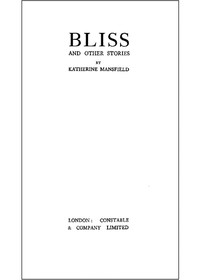

# Bliss, and Other Stories <kbd>v2.2.1</kbd>

## Authors

 - Mansfield, Katherine <small>(1888 - 1923)</small>

## Translators

## Subjects

 - Europe
 - New Zealand
 - Short stories, New Zealand

## Readablility

 - **A1:** 76%
 - **A2:** 82%
 - **B1:** 88%
 - **B2:** 94%
 - **C1:** 98%
 - **C2:** 100%

## Words Count

 - **A1:** 488
 - **A2:** 434
 - **B1:** 699
 - **B2:** 1021
 - **C1:** 1096
 - **C2:** 721

## Source

<kbd>GUTHENBURGE:44385</kbd>
