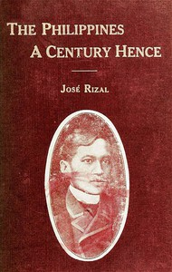

# The Philippines a Century Hence <kbd>v2.2.1</kbd>

## Authors

 - Rizal, José <small>(1861 - 1896)</small>

## Translators

 - Derbyshire, Charles E. <small>(-1 - -1)</small>

## Subjects

 - Philippines

## Readablility

 - **A1:** 72%
 - **A2:** 78%
 - **B1:** 85%
 - **B2:** 92%
 - **C1:** 98%
 - **C2:** 100%

## Words Count

 - **A1:** 450
 - **A2:** 335
 - **B1:** 533
 - **B2:** 713
 - **C1:** 621
 - **C2:** 326

## Source

<kbd>GUTHENBURGE:35899</kbd>
