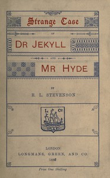

# The Strange Case of Dr. Jekyll and Mr. Hyde <kbd>v2.0.2</kbd>

## Authors

 - Stevenson, Robert Louis <small>(1850 - 1894)</small>

## Translators

## Subjects

 - Horror tales
 - London (England)
 - Multiple personality
 - Physicians
 - Psychological fiction
 - Science fiction
 - Self-experimentation in medicine

## Readablility

 - **A1:** 52%
 - **A2:** 60%
 - **B1:** 71%
 - **B2:** 85%
 - **C1:** 88%
 - **C2:** 100%

## Words Count

 - **A1:** 470
 - **A2:** 379
 - **B1:** 619
 - **B2:** 873
 - **C1:** 314
 - **C2:** 1689

## Source

<kbd>GUTHENBURGE:42</kbd>
