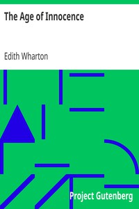

# The Age of Innocence <kbd>v2.2.1</kbd>

## Authors

 - Wharton, Edith <small>(1862 - 1937)</small>

## Translators

## Subjects

 - Domestic fiction
 - Love stories
 - Married people
 - New York (N.Y.)
 - Separated people
 - Triangles (Interpersonal relations)
 - Upper class

## Readablility

 - **A1:** 77%
 - **A2:** 83%
 - **B1:** 88%
 - **B2:** 93%
 - **C1:** 97%
 - **C2:** 100%

## Words Count

 - **A1:** 490
 - **A2:** 480
 - **B1:** 873
 - **B2:** 1460
 - **C1:** 1812
 - **C2:** 1317

## Source

<kbd>GUTHENBURGE:541</kbd>
