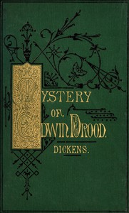

# The Mystery of Edwin Drood <kbd>v2.2.1</kbd>

## Authors

 - Dickens, Charles <small>(1812 - 1870)</small>

## Translators

## Subjects

 - Cathedrals
 - Choral conductors
 - England
 - Missing persons
 - Mystery fiction
 - Psychological fiction
 - Separation (Psychology)
 - Triangles (Interpersonal relations)

## Readablility

 - **A1:** 77%
 - **A2:** 82%
 - **B1:** 87%
 - **B2:** 92%
 - **C1:** 97%
 - **C2:** 100%

## Words Count

 - **A1:** 494
 - **A2:** 480
 - **B1:** 886
 - **B2:** 1495
 - **C1:** 1932
 - **C2:** 1354

## Source

<kbd>GUTHENBURGE:564</kbd>
