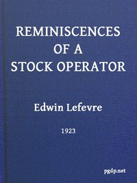

# Reminiscences of a Stock Operator <kbd>v2.2.1</kbd>

## Authors

 - Lefevre, Edwin <small>(1871 - 1943)</small>

## Translators

## Subjects

 - Investments
 - New York Stock Exchange
 - Speculation

## Readablility

 - **A1:** 76%
 - **A2:** 82%
 - **B1:** 89%
 - **B2:** 94%
 - **C1:** 98%
 - **C2:** 100%

## Words Count

 - **A1:** 487
 - **A2:** 445
 - **B1:** 767
 - **B2:** 1120
 - **C1:** 1183
 - **C2:** 813

## Source

<kbd>GUTHENBURGE:60979</kbd>
