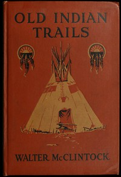

# Old Indian trails <kbd>v2.3.0</kbd>

## Authors

 - McClintock, Walter <small>(1870 - 1949)</small>

## Translators

## Subjects

 - Old North Trail
 - Siksika Indians

## Readablility

 - **A1:** 71%
 - **A2:** 78%
 - **B1:** 85%
 - **B2:** 92%
 - **C1:** 97%
 - **C2:** 100%

## Words Count

 - **A1:** 478
 - **A2:** 435
 - **B1:** 735
 - **B2:** 1134
 - **C1:** 1235
 - **C2:** 822

## Source

<kbd>GUTHENBURGE:68074</kbd>
