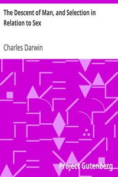

# The Descent of Man, and Selection in Relation to Sex <kbd>v2.2.1</kbd>

## Authors

 - Darwin, Charles <small>(1809 - 1882)</small>

## Translators

## Subjects

 - Evolution (Biology)
 - Human beings
 - Sex differences
 - Sexual dimorphism (Animals)
 - Sexual selection in animals

## Readablility

 - **A1:** 70%
 - **A2:** 75%
 - **B1:** 83%
 - **B2:** 89%
 - **C1:** 96%
 - **C2:** 100%

## Words Count

 - **A1:** 491
 - **A2:** 473
 - **B1:** 886
 - **B2:** 1478
 - **C1:** 1956
 - **C2:** 1712

## Source

<kbd>GUTHENBURGE:2300</kbd>
