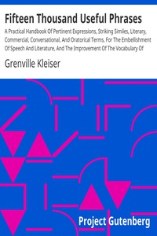

# Fifteen Thousand Useful Phrases: A Practical Handbook Of Pertinent Expressions, Striking Similes, Literary, Commercial, Conversational, And Oratorical Terms, For The Embellishment Of Speech And Literature, And The Improvement Of The Vocabulary Of Those Persons Who Read, Write, And Speak English <kbd>v2.2.1</kbd>

## Authors

 - Kleiser, Grenville <small>(1868 - 1953)</small>

## Translators

## Subjects

 - English language

## Readablility

 - **A1:** 62%
 - **A2:** 68%
 - **B1:** 75%
 - **B2:** 83%
 - **C1:** 92%
 - **C2:** 99%

## Words Count

 - **A1:** 483
 - **A2:** 454
 - **B1:** 849
 - **B2:** 1453
 - **C1:** 2263
 - **C2:** 2746

## Source

<kbd>GUTHENBURGE:18362</kbd>
