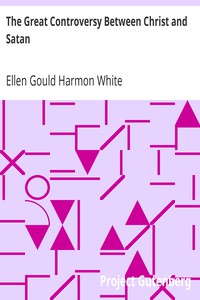

# The Great Controversy Between Christ and Satan <kbd>v2.2.1</kbd>

## Authors

 - White, Ellen Gould Harmon <small>(1827 - 1915)</small>

## Translators

## Subjects

 - Good and evil
 - Seventh-Day Adventists
 - Spiritual direction

## Readablility

 - **A1:** 74%
 - **A2:** 79%
 - **B1:** 86%
 - **B2:** 92%
 - **C1:** 97%
 - **C2:** 100%

## Words Count

 - **A1:** 492
 - **A2:** 479
 - **B1:** 915
 - **B2:** 1622
 - **C1:** 2269
 - **C2:** 1727

## Source

<kbd>GUTHENBURGE:25833</kbd>
