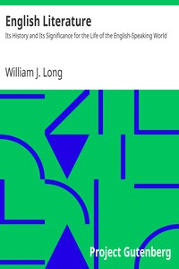

# English Literature: Its History and Its Significance for the Life of the English-Speaking World <kbd>v2.2.1</kbd>

## Authors

 - Long, William J. (William Joseph) <small>(1867 - 1952)</small>

## Translators

## Subjects

 - English literature

## Readablility

 - **A1:** 73%
 - **A2:** 79%
 - **B1:** 85%
 - **B2:** 92%
 - **C1:** 98%
 - **C2:** 100%

## Words Count

 - **A1:** 495
 - **A2:** 490
 - **B1:** 963
 - **B2:** 1720
 - **C1:** 2394
 - **C2:** 1902

## Source

<kbd>GUTHENBURGE:10609</kbd>
