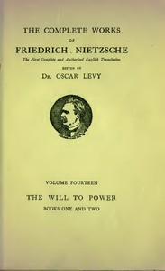

# The Will to Power: An Attempted Transvaluation of All Values. Book I and II <kbd>v2.3.0</kbd>

## Authors

 - Nietzsche, Friedrich Wilhelm <small>(1844 - 1900)</small>

## Translators

 - Ludovici, Anthony M. (Anthony Mario) <small>(1882 - 1971)</small>

## Subjects

 - Nihilism (Philosophy)
 - Power (Philosophy)
 - Values

## Readablility

 - **A1:** 72%
 - **A2:** 78%
 - **B1:** 85%
 - **B2:** 91%
 - **C1:** 97%
 - **C2:** 100%

## Words Count

 - **A1:** 476
 - **A2:** 414
 - **B1:** 734
 - **B2:** 1149
 - **C1:** 1374
 - **C2:** 1122

## Source

<kbd>GUTHENBURGE:52914</kbd>
