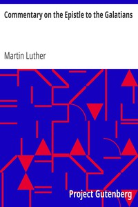

# Commentary on the Epistle to the Galatians <kbd>v2.2.1</kbd>

## Authors

 - Luther, Martin <small>(1483 - 1546)</small>

## Translators

 - Graebner, Theodore <small>(1876 - 1950)</small>

## Subjects

 - Bible. Galatians

## Readablility

 - **A1:** 76%
 - **A2:** 81%
 - **B1:** 88%
 - **B2:** 93%
 - **C1:** 98%
 - **C2:** 100%

## Words Count

 - **A1:** 479
 - **A2:** 409
 - **B1:** 713
 - **B2:** 1014
 - **C1:** 1130
 - **C2:** 786

## Source

<kbd>GUTHENBURGE:1549</kbd>
