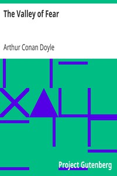

# The Valley of Fear <kbd>v2.3.0</kbd>

## Authors

 - Doyle, Arthur Conan <small>(1859 - 1930)</small>

## Translators

## Subjects

 - Detective and mystery stories
 - Holmes, Sherlock (Fictitious character)
 - Private investigators

## Readablility

 - **A1:** 79%
 - **A2:** 84%
 - **B1:** 90%
 - **B2:** 94%
 - **C1:** 98%
 - **C2:** 100%

## Words Count

 - **A1:** 487
 - **A2:** 463
 - **B1:** 801
 - **B2:** 1105
 - **C1:** 1109
 - **C2:** 633

## Source

<kbd>GUTHENBURGE:3289</kbd>
