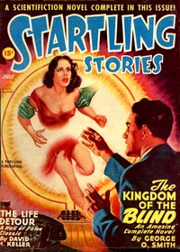

# Dream's end <kbd>v2.3.0</kbd>

## Authors

 - Kuttner, Henry <small>(1915 - 1958)</small>

## Translators

## Subjects

 - Dreams
 - Experiments
 - Physicians
 - Psychological fiction
 - Science fiction
 - Short stories

## Readablility

 - **A1:** 72%
 - **A2:** 79%
 - **B1:** 86%
 - **B2:** 92%
 - **C1:** 98%
 - **C2:** 100%

## Words Count

 - **A1:** 375
 - **A2:** 202
 - **B1:** 262
 - **B2:** 295
 - **C1:** 244
 - **C2:** 113

## Source

<kbd>GUTHENBURGE:68170</kbd>
