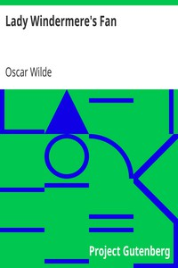

# Lady Windermere's Fan <kbd>v2.2.1</kbd>

## Authors

 - Wilde, Oscar <small>(1854 - 1900)</small>

## Translators

## Subjects

 - Aristocracy (Social class)
 - Marriage
 - Mothers and daughters

## Readablility

 - **A1:** 80%
 - **A2:** 85%
 - **B1:** 91%
 - **B2:** 95%
 - **C1:** 99%
 - **C2:** 99%

## Words Count

 - **A1:** 438
 - **A2:** 304
 - **B1:** 421
 - **B2:** 455
 - **C1:** 379
 - **C2:** 97

## Source

<kbd>GUTHENBURGE:790</kbd>
