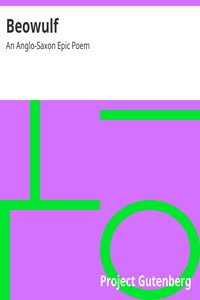

# Beowulf: An Anglo-Saxon Epic Poem <kbd>v2.3.0</kbd>

## Authors

## Translators

 - Hall, J. Lesslie (John Lesslie) <small>(1856 - 1928)</small>

## Subjects

 - Dragons
 - Epic poetry, English (Old)
 - Monsters

## Readablility

 - **A1:** 72%
 - **A2:** 77%
 - **B1:** 84%
 - **B2:** 91%
 - **C1:** 97%
 - **C2:** 100%

## Words Count

 - **A1:** 475
 - **A2:** 376
 - **B1:** 597
 - **B2:** 880
 - **C1:** 867
 - **C2:** 562

## Source

<kbd>GUTHENBURGE:16328</kbd>
