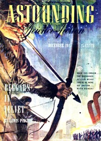

# Trouble Times Two <kbd>v2.2.1</kbd>

## Authors

 - Smith, George O. (George Oliver) <small>(1911 - 1981)</small>

## Translators

## Subjects

 - Engineers
 - Multiple personality
 - Physicists
 - Science fiction

## Readablility

 - **A1:** 71%
 - **A2:** 77%
 - **B1:** 85%
 - **B2:** 91%
 - **C1:** 97%
 - **C2:** 99%

## Words Count

 - **A1:** 413
 - **A2:** 259
 - **B1:** 359
 - **B2:** 403
 - **C1:** 346
 - **C2:** 223

## Source

<kbd>GUTHENBURGE:68161</kbd>
