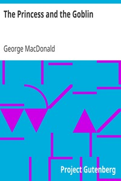

# The Princess and the Goblin <kbd>v2.3.0</kbd>

## Authors

 - MacDonald, George <small>(1824 - 1905)</small>

## Translators

## Subjects

 - Children's stories
 - Fairy tales
 - Fantasy literature
 - Goblins
 - Princesses

## Readablility

 - **A1:** 80%
 - **A2:** 85%
 - **B1:** 91%
 - **B2:** 96%
 - **C1:** 99%
 - **C2:** 100%

## Words Count

 - **A1:** 476
 - **A2:** 424
 - **B1:** 697
 - **B2:** 875
 - **C1:** 776
 - **C2:** 309

## Source

<kbd>GUTHENBURGE:708</kbd>
