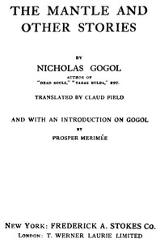

# The Mantle, and Other Stories <kbd>v2.3.0</kbd>

## Authors

 - Gogol, Nikolai Vasilevich <small>(1809 - 1852)</small>

## Translators

 - Field, Claud <small>(1863 - 1941)</small>

## Subjects

 - Gogol, Nikolai Vasilevich, 1809-1852
 - Russia
 - Short stories, Russian

## Readablility

 - **A1:** 75%
 - **A2:** 82%
 - **B1:** 88%
 - **B2:** 94%
 - **C1:** 98%
 - **C2:** 100%

## Words Count

 - **A1:** 488
 - **A2:** 465
 - **B1:** 813
 - **B2:** 1213
 - **C1:** 1269
 - **C2:** 654

## Source

<kbd>GUTHENBURGE:36238</kbd>
