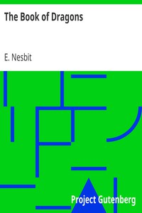

# The Book of Dragons <kbd>v2.2.1</kbd>

## Authors

 - Nesbit, E. (Edith) <small>(1858 - 1924)</small>

## Translators

## Subjects

 - Children's stories, English
 - Dragons
 - Dragons
 - Short stories

## Readablility

 - **A1:** 77%
 - **A2:** 83%
 - **B1:** 88%
 - **B2:** 94%
 - **C1:** 98%
 - **C2:** 100%

## Words Count

 - **A1:** 478
 - **A2:** 395
 - **B1:** 602
 - **B2:** 745
 - **C1:** 696
 - **C2:** 394

## Source

<kbd>GUTHENBURGE:23661</kbd>
