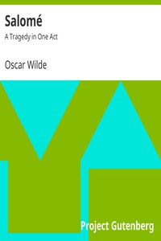

# Salomé: A Tragedy in One Act <kbd>v2.2.1</kbd>

## Authors

 - Wilde, Oscar <small>(1854 - 1900)</small>

## Translators

 - Douglas, Alfred Bruce <small>(1870 - 1945)</small>

## Subjects

 - Salome (Biblical figure)
 - Tragedies

## Readablility

 - **A1:** 77%
 - **A2:** 83%
 - **B1:** 89%
 - **B2:** 95%
 - **C1:** 99%
 - **C2:** 100%

## Words Count

 - **A1:** 427
 - **A2:** 257
 - **B1:** 333
 - **B2:** 417
 - **C1:** 307
 - **C2:** 143

## Source

<kbd>GUTHENBURGE:42704</kbd>
