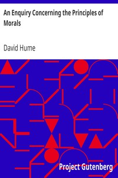

# An Enquiry Concerning the Principles of Morals <kbd>v2.2.1</kbd>

## Authors

 - Hume, David <small>(1711 - 1776)</small>

## Translators

## Subjects

 - Conduct of life
 - Ethics

## Readablility

 - **A1:** 69%
 - **A2:** 76%
 - **B1:** 83%
 - **B2:** 92%
 - **C1:** 97%
 - **C2:** 100%

## Words Count

 - **A1:** 461
 - **A2:** 379
 - **B1:** 660
 - **B2:** 968
 - **C1:** 1069
 - **C2:** 637

## Source

<kbd>GUTHENBURGE:4320</kbd>
