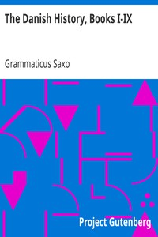

# The Danish History, Books I-IX <kbd>v2.3.0</kbd>

## Authors

 - Saxo, Grammaticus <small>(-1 - -1)</small>

## Translators

 - Elton, Oliver <small>(1861 - 1945)</small>

## Subjects

 - Denmark
 - Folklore

## Readablility

 - **A1:** 74%
 - **A2:** 79%
 - **B1:** 85%
 - **B2:** 92%
 - **C1:** 97%
 - **C2:** 100%

## Words Count

 - **A1:** 492
 - **A2:** 483
 - **B1:** 922
 - **B2:** 1611
 - **C1:** 2233
 - **C2:** 1900

## Source

<kbd>GUTHENBURGE:1150</kbd>
