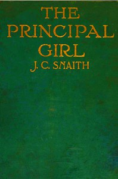

# The principal girl <kbd>v2.2.1</kbd>

## Authors

 - Snaith, J. C. (John Collis) <small>(1876 - 1936)</small>

## Translators

## Subjects

 - Courtship
 - England
 - Families
 - Marriage
 - Mate selection
 - Social classes

## Readablility

 - **A1:** 76%
 - **A2:** 82%
 - **B1:** 88%
 - **B2:** 93%
 - **C1:** 97%
 - **C2:** 100%

## Words Count

 - **A1:** 492
 - **A2:** 457
 - **B1:** 786
 - **B2:** 1167
 - **C1:** 1275
 - **C2:** 882

## Source

<kbd>GUTHENBURGE:68069</kbd>
