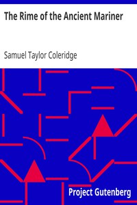

# The Rime of the Ancient Mariner <kbd>v2.2.1</kbd>

## Authors

 - Coleridge, Samuel Taylor <small>(1772 - 1834)</small>

## Translators

## Subjects

 - Poetry

## Readablility

 - **A1:** 69%
 - **A2:** 77%
 - **B1:** 84%
 - **B2:** 92%
 - **C1:** 98%
 - **C2:** 100%

## Words Count

 - **A1:** 360
 - **A2:** 196
 - **B1:** 239
 - **B2:** 297
 - **C1:** 235
 - **C2:** 93

## Source

<kbd>GUTHENBURGE:151</kbd>
