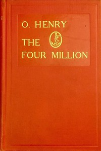

# The Four Million <kbd>v2.3.0</kbd>

## Authors

 - Henry, O. <small>(1862 - 1910)</small>

## Translators

## Subjects

 - New York (N.Y.)
 - Short stories, American

## Readablility

 - **A1:** 74%
 - **A2:** 80%
 - **B1:** 86%
 - **B2:** 92%
 - **C1:** 96%
 - **C2:** 100%

## Words Count

 - **A1:** 491
 - **A2:** 461
 - **B1:** 820
 - **B2:** 1270
 - **C1:** 1444
 - **C2:** 1132

## Source

<kbd>GUTHENBURGE:2776</kbd>
