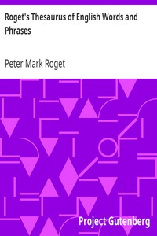

# Roget's Thesaurus of English Words and Phrases <kbd>v2.3.0</kbd>

## Authors

 - Roget, Peter Mark <small>(1779 - 1869)</small>

## Translators

## Subjects

 - English language

## Readablility

 - **A1:** 59%
 - **A2:** 65%
 - **B1:** 72%
 - **B2:** 79%
 - **C1:** 88%
 - **C2:** 98%

## Words Count

 - **A1:** 478
 - **A2:** 476
 - **B1:** 919
 - **B2:** 1715
 - **C1:** 3220
 - **C2:** 6438

## Source

<kbd>GUTHENBURGE:10681</kbd>
