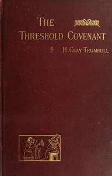

# The Threshold Covenant; or, The Beginning of Religious Rites <kbd>v2.2.1</kbd>

## Authors

 - Trumbull, H. Clay (Henry Clay) <small>(1830 - 1903)</small>

## Translators

## Subjects

 - Covenants

## Readablility

 - **A1:** 73%
 - **A2:** 78%
 - **B1:** 84%
 - **B2:** 91%
 - **C1:** 97%
 - **C2:** 100%

## Words Count

 - **A1:** 492
 - **A2:** 432
 - **B1:** 731
 - **B2:** 1110
 - **C1:** 1205
 - **C2:** 832

## Source

<kbd>GUTHENBURGE:49216</kbd>
