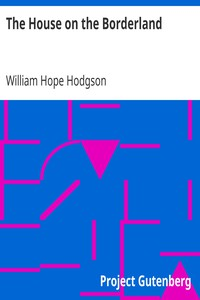

# The House on the Borderland <kbd>v2.2.1</kbd>

## Authors

 - Hodgson, William Hope <small>(1877 - 1918)</small>

## Translators

## Subjects

 - Science fiction

## Readablility

 - **A1:** 75%
 - **A2:** 81%
 - **B1:** 88%
 - **B2:** 94%
 - **C1:** 98%
 - **C2:** 100%

## Words Count

 - **A1:** 472
 - **A2:** 412
 - **B1:** 665
 - **B2:** 957
 - **C1:** 985
 - **C2:** 600

## Source

<kbd>GUTHENBURGE:10002</kbd>
