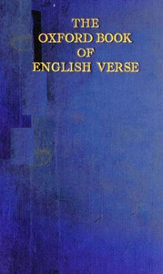

# The Oxford Book of English Verse, 1250-1900 <kbd>v2.3.0</kbd>

## Authors

## Translators

## Subjects

 - English poetry

## Readablility

 - **A1:** 73%
 - **A2:** 80%
 - **B1:** 86%
 - **B2:** 92%
 - **C1:** 97%
 - **C2:** 100%

## Words Count

 - **A1:** 489
 - **A2:** 462
 - **B1:** 827
 - **B2:** 1441
 - **C1:** 2126
 - **C2:** 2157

## Source

<kbd>GUTHENBURGE:66619</kbd>
