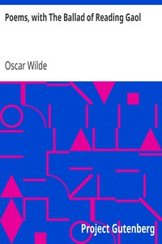

# Poems, with The Ballad of Reading Gaol <kbd>v2.3.0</kbd>

## Authors

 - Wilde, Oscar <small>(1854 - 1900)</small>

## Translators

## Subjects

 - Poetry
 - Prisons

## Readablility

 - **A1:** 69%
 - **A2:** 76%
 - **B1:** 83%
 - **B2:** 89%
 - **C1:** 96%
 - **C2:** 100%

## Words Count

 - **A1:** 449
 - **A2:** 349
 - **B1:** 556
 - **B2:** 792
 - **C1:** 948
 - **C2:** 815

## Source

<kbd>GUTHENBURGE:1057</kbd>
