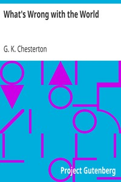

# What's Wrong with the World <kbd>v2.3.0</kbd>

## Authors

 - Chesterton, G. K. (Gilbert Keith) <small>(1874 - 1936)</small>

## Translators

## Subjects

 - Social problems

## Readablility

 - **A1:** 74%
 - **A2:** 80%
 - **B1:** 86%
 - **B2:** 92%
 - **C1:** 97%
 - **C2:** 100%

## Words Count

 - **A1:** 484
 - **A2:** 454
 - **B1:** 793
 - **B2:** 1227
 - **C1:** 1438
 - **C2:** 1046

## Source

<kbd>GUTHENBURGE:1717</kbd>
