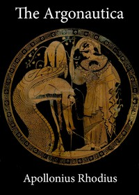

# The Argonautica <kbd>v2.3.0</kbd>

## Authors

 - Apollonius, Rhodius <small>(-1 - -1)</small>

## Translators

 - Seaton, R. C. (Robert Cooper) <small>(1853 - 1915)</small>

## Subjects

 - Argonauts (Greek mythology)
 - Classical literature
 - Jason
 - Medea, consort of Aegeus, King of Athens (Mythological character)

## Readablility

 - **A1:** 75%
 - **A2:** 80%
 - **B1:** 86%
 - **B2:** 92%
 - **C1:** 98%
 - **C2:** 100%

## Words Count

 - **A1:** 470
 - **A2:** 378
 - **B1:** 615
 - **B2:** 934
 - **C1:** 1102
 - **C2:** 650

## Source

<kbd>GUTHENBURGE:830</kbd>
