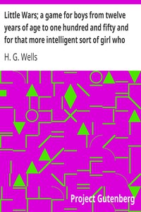

# Little Wars; a game for boys from twelve years of age to one hundred and fifty and for that more intelligent sort of girl who likes boys' games and books. <kbd>v2.2.1</kbd>

## Authors

 - Wells, H. G. (Herbert George) <small>(1866 - 1946)</small>

## Translators

## Subjects

 - War games

## Readablility

 - **A1:** 71%
 - **A2:** 79%
 - **B1:** 86%
 - **B2:** 93%
 - **C1:** 98%
 - **C2:** 100%

## Words Count

 - **A1:** 419
 - **A2:** 286
 - **B1:** 413
 - **B2:** 535
 - **C1:** 441
 - **C2:** 203

## Source

<kbd>GUTHENBURGE:3691</kbd>
