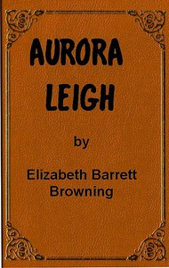

# Aurora Leigh <kbd>v2.3.0</kbd>

## Authors

 - Browning, Elizabeth Barrett <small>(1806 - 1861)</small>

## Translators

## Subjects

 - English poetry
 - Epic poetry, English
 - Novels in verse

## Readablility

 - **A1:** 76%
 - **A2:** 82%
 - **B1:** 88%
 - **B2:** 93%
 - **C1:** 97%
 - **C2:** 100%

## Words Count

 - **A1:** 490
 - **A2:** 467
 - **B1:** 806
 - **B2:** 1271
 - **C1:** 1588
 - **C2:** 1287

## Source

<kbd>GUTHENBURGE:56621</kbd>
