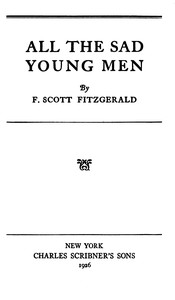

# All the Sad Young Men <kbd>v2.2.1</kbd>

## Authors

 - Fitzgerald, F. Scott (Francis Scott) <small>(1896 - 1940)</small>

## Translators

## Subjects

 - American fiction
 - Short stories, American

## Readablility

 - **A1:** 77%
 - **A2:** 83%
 - **B1:** 89%
 - **B2:** 94%
 - **C1:** 98%
 - **C2:** 100%

## Words Count

 - **A1:** 488
 - **A2:** 454
 - **B1:** 799
 - **B2:** 1170
 - **C1:** 1300
 - **C2:** 846

## Source

<kbd>GUTHENBURGE:68229</kbd>
