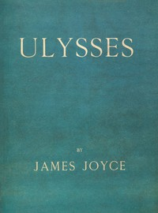

# Ulysses <kbd>v2.0.7</kbd>

## Authors

 - Joyce, James <small>(1882 - 1941)</small>

## Translators

## Subjects

 - Alienation (Social psychology)
 - Artists
 - City and town life
 - Domestic fiction
 - Dublin (Ireland)
 - Epic literature
 - Jewish men
 - Male friendship
 - Married people
 - Psychological fiction

## Readablility

 - **A1:** 59%
 - **A2:** 64%
 - **B1:** 70%
 - **B2:** 75%
 - **C1:** 77%
 - **C2:** 100%

## Words Count

 - **A1:** 950
 - **A2:** 835
 - **B1:** 1461
 - **B2:** 2256
 - **C1:** 1017
 - **C2:** 23790

## Source

<kbd>GUTHENBURGE:4300</kbd>
