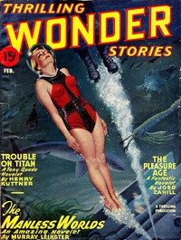

# Trouble on Titan <kbd>v2.2.1</kbd>

## Authors

 - Kuttner, Henry <small>(1915 - 1958)</small>

## Translators

## Subjects

 - Human-alien encounters
 - Man-woman relationships
 - Moon
 - Motion picture industry
 - Science fiction
 - Titan (Satellite)

## Readablility

 - **A1:** 72%
 - **A2:** 78%
 - **B1:** 85%
 - **B2:** 91%
 - **C1:** 96%
 - **C2:** 100%

## Words Count

 - **A1:** 427
 - **A2:** 275
 - **B1:** 389
 - **B2:** 483
 - **C1:** 408
 - **C2:** 281

## Source

<kbd>GUTHENBURGE:68076</kbd>
