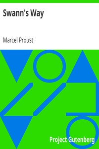

# Swann's Way <kbd>v2.2.1</kbd>

## Authors

 - Proust, Marcel <small>(1871 - 1922)</small>

## Translators

 - Scott-Moncrieff, C. K. (Charles Kenneth) <small>(1889 - 1930)</small>

## Subjects

 - Autobiographical fiction
 - France
 - Villages

## Readablility

 - **A1:** 78%
 - **A2:** 83%
 - **B1:** 89%
 - **B2:** 94%
 - **C1:** 98%
 - **C2:** 100%

## Words Count

 - **A1:** 491
 - **A2:** 486
 - **B1:** 946
 - **B2:** 1728
 - **C1:** 2562
 - **C2:** 2199

## Source

<kbd>GUTHENBURGE:7178</kbd>
