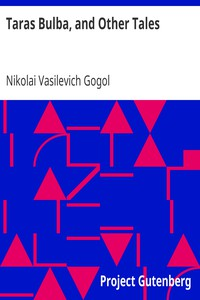

# Taras Bulba, and Other Tales <kbd>v2.3.0</kbd>

## Authors

 - Gogol, Nikolai Vasilevich <small>(1809 - 1852)</small>

## Translators

## Subjects

 - Russia
 - Short stories

## Readablility

 - **A1:** 75%
 - **A2:** 81%
 - **B1:** 87%
 - **B2:** 93%
 - **C1:** 98%
 - **C2:** 100%

## Words Count

 - **A1:** 494
 - **A2:** 487
 - **B1:** 929
 - **B2:** 1549
 - **C1:** 1988
 - **C2:** 1216

## Source

<kbd>GUTHENBURGE:1197</kbd>
