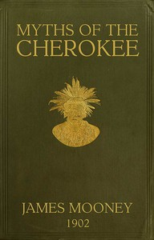

# Myths of the Cherokee: Extract from the Nineteenth Annual Report of the Bureau of American Ethnology <kbd>v2.3.0</kbd>

## Authors

 - Mooney, James <small>(1861 - 1921)</small>

## Translators

## Subjects

 - Cherokee Indians
 - Cherokee Indians
 - Cherokee mythology
 - Legends
 - Tales

## Readablility

 - **A1:** 74%
 - **A2:** 80%
 - **B1:** 86%
 - **B2:** 92%
 - **C1:** 96%
 - **C2:** 100%

## Words Count

 - **A1:** 494
 - **A2:** 490
 - **B1:** 957
 - **B2:** 1729
 - **C1:** 2462
 - **C2:** 1995

## Source

<kbd>GUTHENBURGE:45634</kbd>
