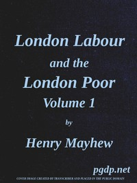

# London Labour and the London Poor, Vol. 1 <kbd>v2.2.1</kbd>

## Authors

 - Mayhew, Henry <small>(1812 - 1887)</small>

## Translators

## Subjects

 - Charities
 - Criminals
 - London (England)
 - Poor
 - Prostitution
 - Unemployed
 - Working class

## Readablility

 - **A1:** 76%
 - **A2:** 82%
 - **B1:** 88%
 - **B2:** 93%
 - **C1:** 97%
 - **C2:** 100%

## Words Count

 - **A1:** 495
 - **A2:** 498
 - **B1:** 976
 - **B2:** 1862
 - **C1:** 3023
 - **C2:** 3021

## Source

<kbd>GUTHENBURGE:55998</kbd>
