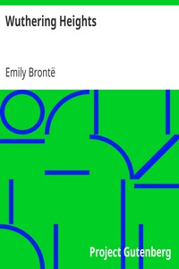

# Wuthering Heights <kbd>GUTHENBURGE</kbd>

## Authors

 - Brontë, Emily <small>(1818 - 1848)</small>

## Translators

## Subjects

 - Domestic fiction
 - Foundlings
 - Heathcliff (Fictitious character : Brontë)
 - Love stories
 - Psychological fiction
 - Rejection (Psychology)
 - Revenge
 - Rural families
 - Triangles (Interpersonal relations)
 - Yorkshire (England)

## Readablility

 - **A1:** 44%
 - **A2:** 59%
 - **B1:** 73%
 - **B2:** 85%
 - **C1:** 95%
 - **C2:** 100%

## Words Count

 - **A1:** 404
 - **A2:** 469
 - **B1:** 882
 - **B2:** 1492
 - **C1:** 1961
 - **C2:** 1377
