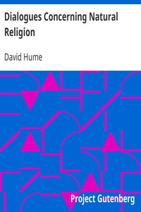

# Dialogues Concerning Natural Religion <kbd>v2.2.1</kbd>

## Authors

 - Hume, David <small>(1711 - 1776)</small>

## Translators

## Subjects

 - Natural theology
 - Religion

## Readablility

 - **A1:** 72%
 - **A2:** 78%
 - **B1:** 84%
 - **B2:** 92%
 - **C1:** 98%
 - **C2:** 100%

## Words Count

 - **A1:** 442
 - **A2:** 342
 - **B1:** 572
 - **B2:** 838
 - **C1:** 847
 - **C2:** 469

## Source

<kbd>GUTHENBURGE:4583</kbd>
