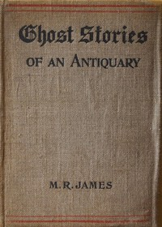

# Ghost Stories of an Antiquary <kbd>v2.2.1</kbd>

## Authors

 - James, M. R. (Montague Rhodes) <small>(1862 - 1936)</small>

## Translators

## Subjects

 - Ghost stories, English
 - Horror tales, English
 - Short stories, English

## Readablility

 - **A1:** 77%
 - **A2:** 84%
 - **B1:** 89%
 - **B2:** 94%
 - **C1:** 98%
 - **C2:** 100%

## Words Count

 - **A1:** 486
 - **A2:** 448
 - **B1:** 764
 - **B2:** 1088
 - **C1:** 1037
 - **C2:** 576

## Source

<kbd>GUTHENBURGE:8486</kbd>
