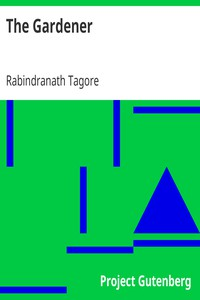

# The Gardener <kbd>v2.3.0</kbd>

## Authors

 - Tagore, Rabindranath <small>(1861 - 1941)</small>

## Translators

## Subjects

 - Bengali poetry
 - Indic poetry
 - Tagore, Rabindranath, 1861-1941

## Readablility

 - **A1:** 72%
 - **A2:** 80%
 - **B1:** 87%
 - **B2:** 93%
 - **C1:** 98%
 - **C2:** 100%

## Words Count

 - **A1:** 423
 - **A2:** 293
 - **B1:** 401
 - **B2:** 506
 - **C1:** 435
 - **C2:** 199

## Source

<kbd>GUTHENBURGE:6686</kbd>
