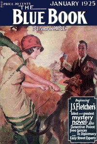

# The Missing Will <kbd>v2.2.1</kbd>

## Authors

 - Christie, Agatha <small>(1890 - 1976)</small>

## Translators

## Subjects

 - Detective and mystery stories
 - Inheritance and succession
 - Poirot, Hercule (Fictitious character)
 - Private investigators
 - Short stories
 - Wills

## Readablility

 - **A1:** 70%
 - **A2:** 78%
 - **B1:** 86%
 - **B2:** 93%
 - **C1:** 98%
 - **C2:** 100%

## Words Count

 - **A1:** 366
 - **A2:** 196
 - **B1:** 252
 - **B2:** 272
 - **C1:** 196
 - **C2:** 62

## Source

<kbd>GUTHENBURGE:67173</kbd>
