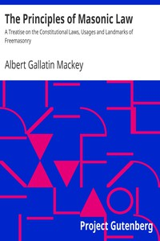

# The Principles of Masonic Law: A Treatise on the Constitutional Laws, Usages and Landmarks of Freemasonry <kbd>v2.2.1</kbd>

## Authors

 - Mackey, Albert Gallatin <small>(1807 - 1881)</small>

## Translators

## Subjects

 - Freemasons

## Readablility

 - **A1:** 70%
 - **A2:** 76%
 - **B1:** 83%
 - **B2:** 89%
 - **C1:** 96%
 - **C2:** 100%

## Words Count

 - **A1:** 451
 - **A2:** 356
 - **B1:** 558
 - **B2:** 825
 - **C1:** 931
 - **C2:** 620

## Source

<kbd>GUTHENBURGE:12186</kbd>
